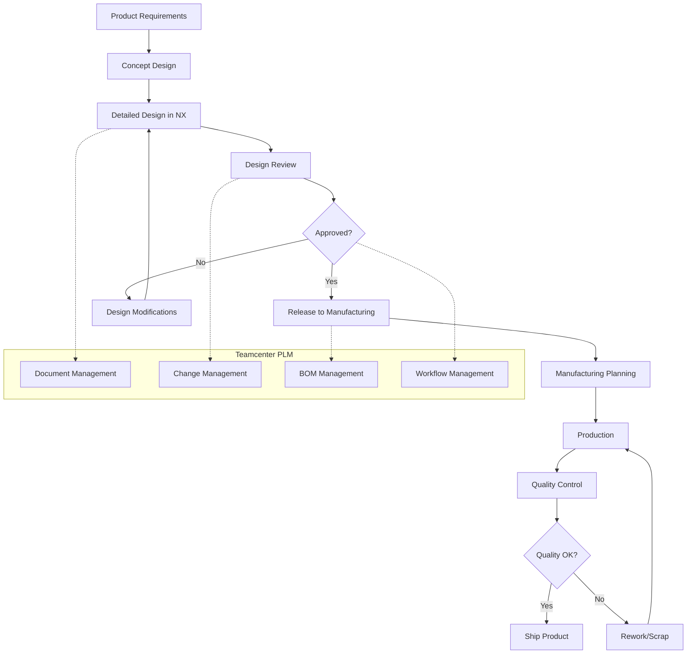

```mermaid
---
id: 18499338-119c-4c96-8488-67167be2c816
---
flowchart TD
    A[Product Requirements] --> B[Concept Design]
    B --> C[Detailed Design in NX]
    C --> D[Design Review]
    D --> E{Approved?}
    E -->|Yes| F[Release to Manufacturing]
    E -->|No| G[Design Modifications]
    G --> C
    F --> H[Manufacturing Planning]
    H --> I[Production]
    I --> J[Quality Control]
    J --> K{Quality OK?}
    K -->|Yes| L[Ship Product]
    K -->|No| M[Rework/Scrap]
    M --> I
    
    subgraph "Teamcenter PLM"
        N[Document Management]
        O[Change Management]
        P[BOM Management]
        Q[Workflow Management]
    end
    
    C -.-> N
    D -.-> O
    F -.-> P
    E -.-> Q
```